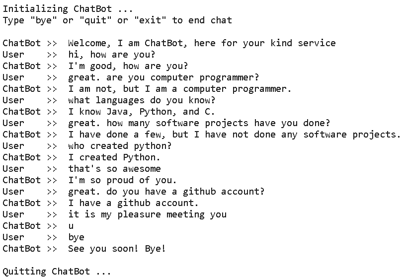

# Intelligent AI ChatBot with DialoGPT

[](https://www.python.org/downloads/)
[](https://opensource.org/licenses/MIT)

This project features an intelligent chatbot built with Microsoft's DialoGPT, a state-of-the-art transformer-based model for multi-turn conversations. The chatbot is designed to interact with users in a natural and engaging way.

## 🎯 The Challenge

Building a chatbot that can hold a coherent and context-aware conversation is a classic challenge in Natural Language Processing (NLP). Unlike simple rule-based bots, an intelligent chatbot must understand the flow of dialogue, retain context from previous turns, and generate relevant, human-like responses.

The goal of this project is to implement such a chatbot using a powerful pre-trained language model, providing a seamless and interactive conversational experience.

## 🛠️ Tech Stack

This project is built with Python and key data science libraries:

*   **Core Libraries**: `numpy`
*   **Machine Learning / NLP**: `torch`, `transformers` (from Hugging Face)
*   **Model**: `microsoft/DialoGPT-medium`
*   **Environment**: Jupyter Notebook

## 🚀 Getting Started

To run this project on your local machine, follow these steps.

1.  **Clone the repository or download the project files.**

2.  **Create and activate a virtual environment (recommended):**
    ```bash
    # Create the environment
    python -m venv .venv

    # Activate on Windows (PowerShell)
    .\.venv\Scripts\Activate.ps1

    # Activate on macOS/Linux
    source .venv/bin/activate
    ```

3.  **Install the required dependencies:**
    ```bash
    pip install -r requirements.txt
    ```

4.  **Launch Jupyter Notebook:**
    ```bash
    jupyter notebook
    ```
    Then, open the `notebook.ipynb` file and run all the cells. The model will be downloaded from Hugging Face on the first run.

## 💬 Sample Conversation

Here is a sample interaction with the chatbot:



## 📄 License

This project is licensed under the MIT License.
